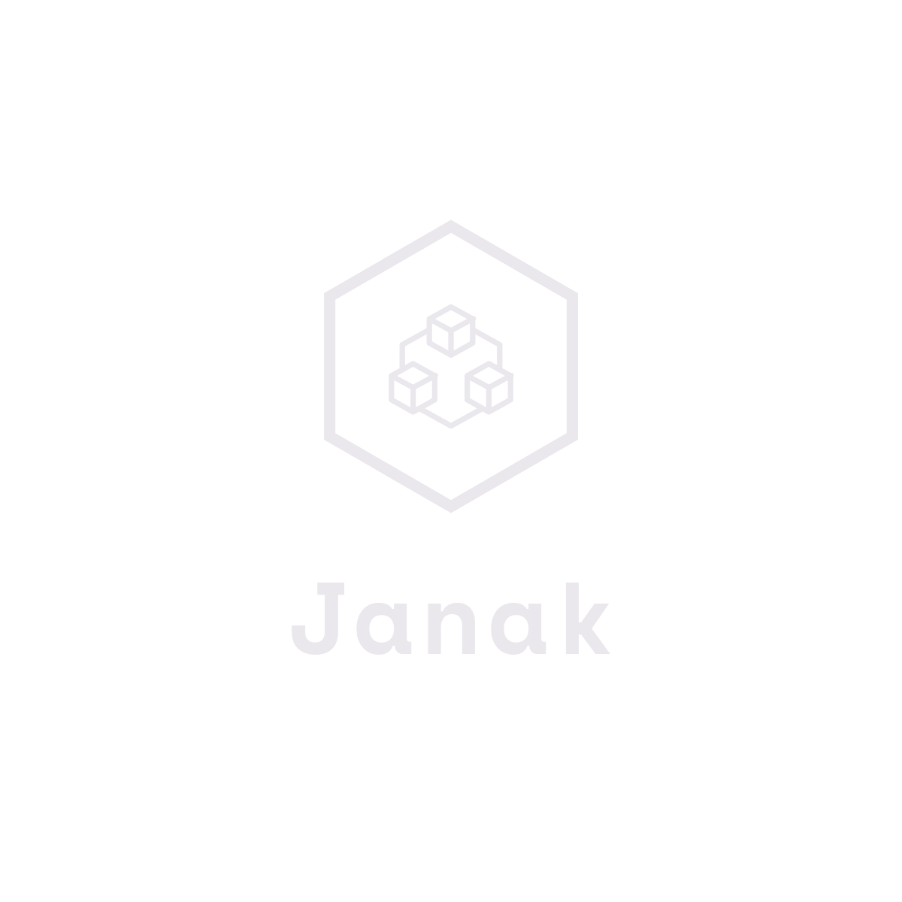

<p align="center">
  
</p>

[](https://github.com/vinayakkulkarni/janak/actions?query=workflow%3A%22Ship+js+trigger%22) [](https://www.npmjs.com/package/janak) [](https://lgtm.com/projects/g/vinayakkulkarni/janak/alerts/) [](https://lgtm.com/projects/g/vinayakkulkarni/janak/context:javascript) [](http://david-dm.org/vinayakkulkarni/janak) [](http://david-dm.org/vinayakkulkarni/janak?type=dev) [](https://www.npmjs.com/package/janak) [](https://github.com/vinayakkulkarni/janak/releases) [](https://github.com/vinayakkulkarni/janak/releases) [](https://github.com/vinayakkulkarni/janak/issues) [](https://github.com/vinayakkulkarni/janak/commits/master)  [](https://github.com/vinayakkulkarni/janak/graphs/contributors)
[](https://app.fossa.com/projects/git%2Bgithub.com%2Fvinayakkulkarni%2Fjanak?ref=badge_shield)

> Quickly scaffold a new Vue 2.x package (with [@vue/composition-api](https://vue-composition-api-rfc.netlify.app/#api-introduction)) without all the headache of setting it up from scratch

<details><summary>Preview</summary>


</details>

## Usage

```bash
npx janak <your-package>
```

## Features
- _🎉[Composition API](template/base/_package.json#L34) baked in_
- _👨‍🔧[TypeScript](template/base/src/Package.vue#L7) support_
- _🎢Build everything using [Rollup](template/base/build/rollup.config.js)_
- _🏗Trigger publishing on npm registry using [ship.js](https://community.algolia.com/shipjs/guide/getting-started.html)_
- _🧪Ava 3.x for testing_
- _🥳[Prettier](template/base/.prettierrc) & [ESLint](template/base/.eslintrc.js) give you powerful linting_
- _👀[jsconfig](template/base/jsconfig.json) for that dope `@/` importing power_
- _🦮[Husky](template/base/husky.config.js) & [Commitlint](template/base/commitlint.config.js)_
- _🤖GitHub Actions [CI](template/base/.github/workflows/shipjs-trigger.yml) for auto-publishing_
- _🤖[Dependabot](template/base/.github/dependabot.yml) for keeping packages upto date_
- _📖[VuePress](https://vuepress.vuejs.org/) for writing those amazing docs!_
- _👨🏻‍💻[Netlify](https://app.netlify.com/) for auto-publishing those amazingly written docs!_


## Notes
- [Janak](https://translate.google.com/#view=home&op=translate&sl=auto&tl=hi&text=Generator) (in Hindi) roughly translates to a generator, hence the name.
- Special thanks to [egoist](https://github.com/egoist), [znck](https://github.com/znck)

## License

MIT &copy; [Vinayak](https://vinayakkulkarni.dev)


[](https://app.fossa.com/projects/git%2Bgithub.com%2Fvinayakkulkarni%2Fjanak?ref=badge_large)